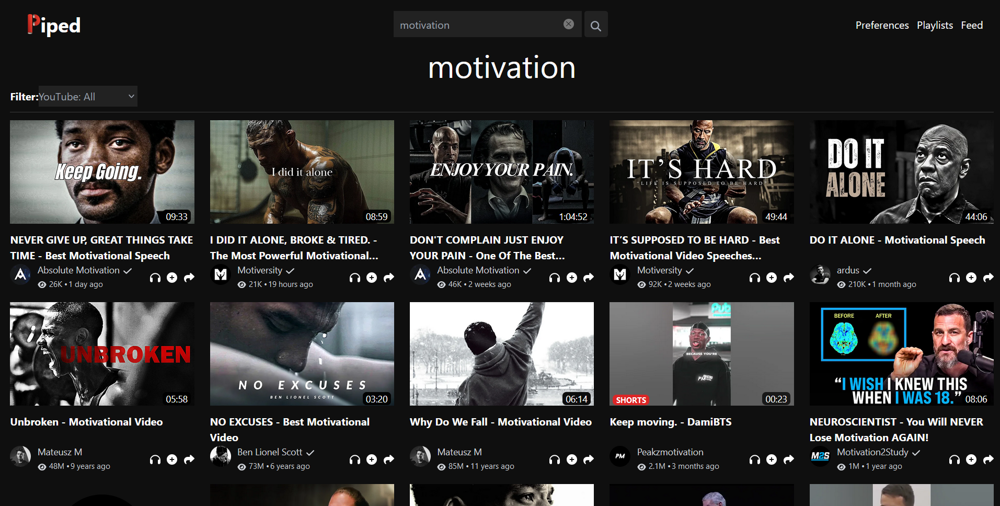

## دانلود ویدیو و صدا از یوتیوب



### توضیح کلی در مورد چرا کد رو نوشتم: (خواندن اختیاری!🤗)
برام سخت بود هی یک به یک لینک ویدیو هارو کپی کنم و بعد با محدودیت برم دانلودشون کنم و هی این کار تکرار میشد. بعضی فیلمارو نیاز داشتم نگه دارم و بعدا وقتی به اینترنت متصل نیستم ببینمشون :) 

البته تاجایی که میتونم و اینترنت یاری میکنه، از یوتیوب نگاه میکنم که بلکه برای سازنده هم خوب باشه ولی چه کنیم که فیلترشکن خیلی باهامون یاری نمیکنه :(

خلاصه گفتم حرکتی کنم و دست از این کار ربات گونه زمان بر بردارم. گشتم از api های موجود اونی که میخواستم رو پیدا نکردم (یعنی کل فیلمای کانال رو لینکشو بگیرم) برای همین این کد ساده رو نوشتم.

البته مصرف شخصی بود و فقط یه بار از بالا به پایین کد نگاه انداختم، نه هندل کردن درست و حسابی ارور ها، نه بهینه تر نوشتن کد و و و :(

خواستم در زمان خیلی محدود (حدود یه ساعت) نتیجه مطلوبم رو بگیرم. امیدوارم اگه مثل من دنبال چنین حرکتی بودین، این به کارتون بیاد.


### ورودی برنامه
لینک piped که همون یوتیوب بدون فیلترشکن هست (همینجا اگه نمیدونستی میتونی الان ازش استفاده کنی!) که میگیره. (خب راحته با یوتیوب هم میشه هندل کردن!)

### توضیح مهم
منطق کد این بود اول فایل `get_all_video_links_of_channel.py` اجرا میشه و تمامی لینک های ویدیو کانال مورد نظر رو تو فایل `video_links.txt` ذخیره میکنه.

بعد فایل `download_all_videos.py` اجرا میشه که میاد تمام لینک هارو میخونه و یکی یکی دانلود میکنه.

برای اجرا نیازه که توی سایت [one-api.ir](https://one-api.ir) ثبت نام کنی و هر چقدر که نیازته شارژ کنی (5 هزار تومن هم کفایت میکنه و زیاد هم هست :))

### توجه
نصف کد موضوع دیگه ای داره و نصف دیگه اش فقط همین کاری که گفتم رو میکنه. که خب با `get_all_video_links_of_channel.py` میشه راحت اونارو هم انجام داد و از api استفاده نکرد و هزینه رو کمتر کرد.

### خروجی لحظه ای کد
```console
getting download ids ---> Hello_Im_Under_The_Water...
getting sound and video download links ---> Hello_Im_Under_The_Water...
File downloaded as Hello_Im_Under_The_Water....m4a
File downloaded as Hello_Im_Under_The_Water....mp4
merging the video and sound ---> Hello_Im_Under_The_Water...
Moviepy - Building video ./merge/Hello_Im_Under_The_Water....mp4.
MoviePy - Writing audio in Hello_Im_Under_The_Water...TEMP_MPY_wvf_snd.mp4
MoviePy - Done.
Moviepy - Writing video ./merge/Hello_Im_Under_The_Water....mp4

t:  64%|███████████████████████████████████████████████████▍                           | 399/915 [00:21<00:21, 23.59it/s, now=None]
```

```console
>>> python .\get_all_video_links_of_channel.py
send youtube/piped channel url: https://piped.video/playlist?list=PLr5CENbugJAjvrKwcOKpLUEO0Zcv6OBkC
launching the browser ...
scrolling the page ...
scrolling the page ...
getting the html file ...
video links saved!

>>> python test.py
+ Running the script ...
+ get download links ---> 1723035094-720p
+ file download as ---> 1723035094-720p.m4a
+ file download as ---> 1723035094-720p.mp4
+ reading the link ---> https://youtube.com/watch?v=DbNjt_und3k&list=PLr5CENbugJAj9Zz98ueXl8WpjJJG-xF83&index=1

progress status: %2.0
+ get download links ---> 1723035109-720p
+ file download as ---> 1723035109-720p.m4a
+ file download as ---> 1723035109-720p.mp4
+ reading the link ---> https://youtube.com/watch?v=135YMp7ttJU&list=PLr5CENbugJAj9Zz98ueXl8WpjJJG-xF83&index=2

progress status: %4.0
+ get download links ---> 1723035123-720p
+ file download as ---> 1723035123-720p.m4a
+ file download as ---> 1723035123-720p.mp4
+ reading the link ---> https://youtube.com/watch?v=Mxjt9L-vXOI&list=PLr5CENbugJAj9Zz98ueXl8WpjJJG-xF83&index=3

progress status: %6.0
+ get download links ---> 1723035136-720p
+ file download as ---> 1723035136-720p.m4a
+ file download as ---> 1723035136-720p.mp4
+ reading the link ---> https://youtube.com/watch?v=0N44hNT32OA&list=PLr5CENbugJAj9Zz98ueXl8WpjJJG-xF83&index=4

progress status: %9.0
+ get download links ---> 1723035149-720p
+ file download as ---> 1723035149-720p.m4a
+ file download as ---> 1723035149-720p.mp4
+ reading the link ---> https://youtube.com/watch?v=OX7292COAg4&list=PLr5CENbugJAj9Zz98ueXl8WpjJJG-xF83&index=5
```
